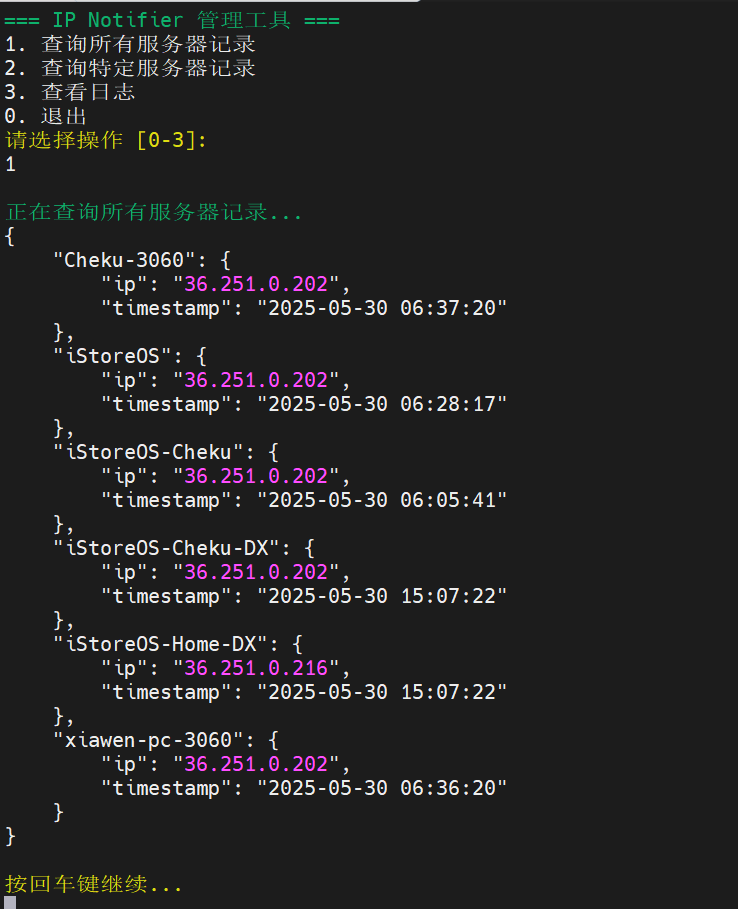
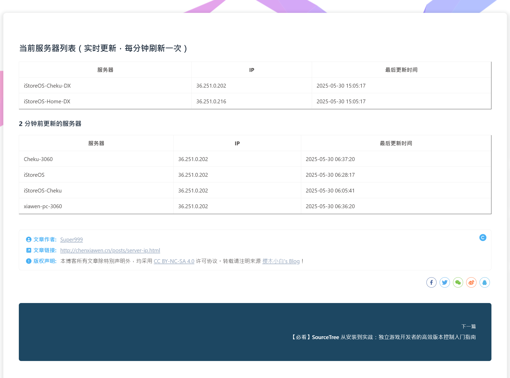
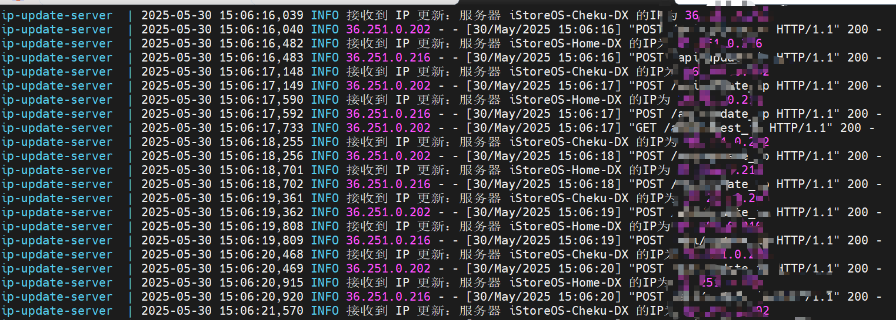

# IP Notifier

一个轻量级的 IP 监控和通知系统，用于跟踪多个服务器的公网 IP 变化。

## 功能特点

- 实时监控服务器 IP 变化
- 支持多服务器管理
- 提供 Web API 接口
- 包含命令行管理工具
- 支持 Docker 部署

## 系统截图

### 命令行工具


### Web 展示界面


### 日志记录


## 快速开始

### 使用 Docker 部署

1. 启动服务端：
```bash
cd server
docker-compose up -d
```

2. 启动客户端：
```bash
cd client
export IP_NOTIFIER_API_KEY="your-api-key"
export IP_NOTIFIER_SERVER_NAME="your-server-name"
docker-compose up -d
```

### 使用命令行工具

```bash
./scripts/ip_notifier_cli.sh
```

## 项目结构

```
IP-Notifier/
├── server/                 # 服务端目录
│   ├── Dockerfile
│   ├── docker-compose.yml
│   ├── requirements.txt
│   ├── ip_update_server.py
│   └── config.py
├── client/                 # 客户端目录
│   ├── Dockerfile
│   ├── docker-compose.yml
│   ├── requirements.txt
│   ├── ip_notifier.py
│   └── config.py
└── scripts/               # 脚本目录
    └── ip_notifier_cli.sh
```

## 技术栈

- Python 3.9
- Flask
- Docker
- Bash

## 许可证

MIT License